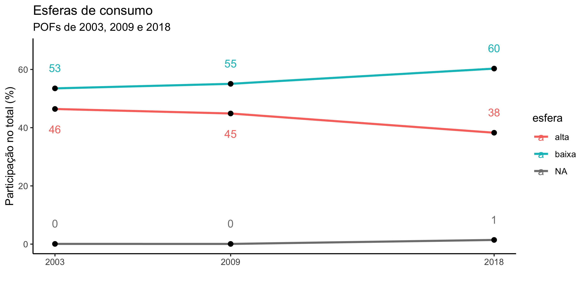
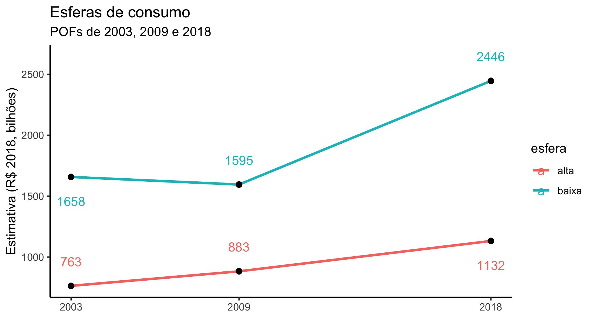
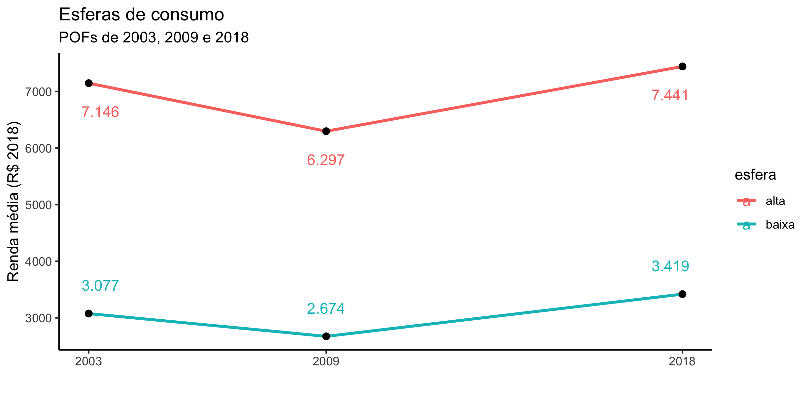

<!-- README.md is generated from README.Rmd. Please edit that file -->

```{r, include = FALSE}
knitr::opts_chunk$set(
  collapse = TRUE,
  comment = "#>"
)
```

> !!Trabalho em progresso!!

# 2020-09-esferas

<!-- badges: start -->
<!-- badges: end -->

Repositório destinado e servir de memória de cálculo para capítulo 
sobre o desenvolvimento das esferas alta e baixa durante esse século,
paseado nas POFs de 2002/3, 2008/9 e 2017/8

Até o momento o projeto está organizado assim:

> ./  
|  
|--- 00_funcoes.R  
|--- 01_rend_resp.R  
|--- 02_rend_resp.R  
|--- 03_rend_resp.R  
|--- 04_comparacoes.R  
|--- ...  
|--- 96_download_leitura_2003.R  
|--- 97_pof2003.R  
|--- 98_download_leitura_2009.R  
|--- 99_pof2009.R  

Os scripts estão numerados na ordem em que devem ser rodados 
na verdade o `96` e o `98` tem que ser rodados antes do `02` e `03`.

```{r, cache = TRUE}
# Isso não é boa prática, depois transformamos em pacote
source("00_funcoes.R")
# Funções carregadas
ls()

t0 <- Sys.time()
source("01_rend_desp.R")
Sys.time() - t0
# tabelas carregadas
ls()
```

Ainda tem alguns arquivos ao final (98 e 99) em caráter preliminar
(até por isso essa numeração).
O que eles fazem é reproduzir o trabalho de 2016.

# Resultados preliminares

## Participação relativa das esferas



## Massa dos valores das esferas (em bilhões de R$ de 2018)



## Renda média das unidades (em R$ de 2018)



## Quantidade de famílias (em milhões de unidades)


